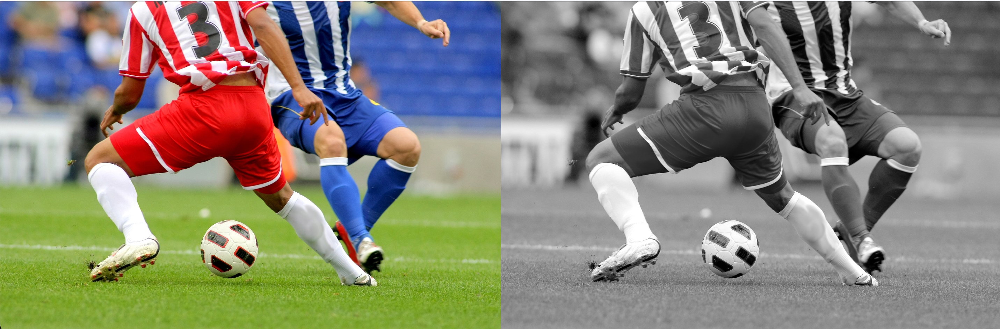
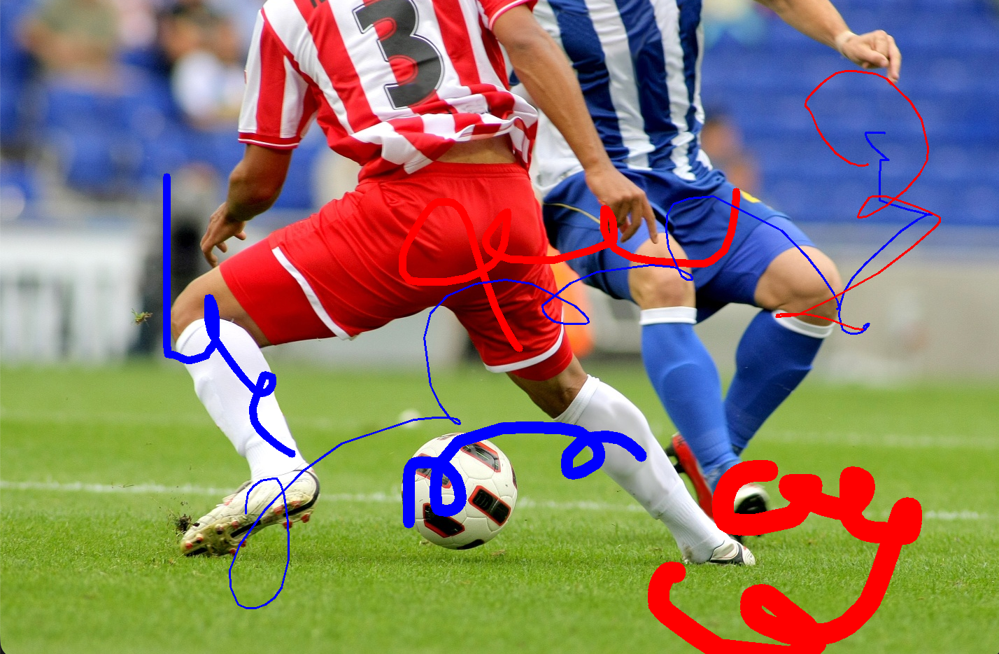
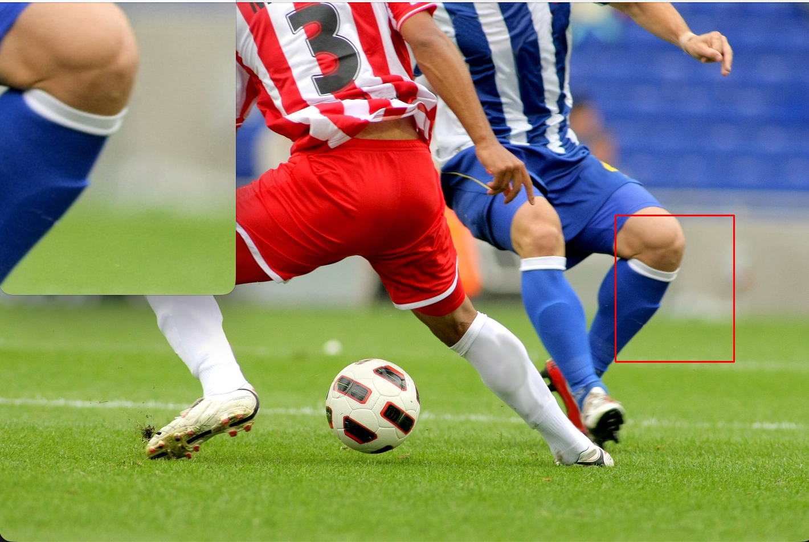

# 📂 OpenCV 실습
## 01. 이미지 불러오기 및 그레이스케일 변환

[입출력과 색상 공간 변환]

### 1. 문제 설명

OpenCV를 사용하여 특정 이미지(soccer.jpg)를 불러온 뒤 화면에 출력합니다.

원본 이미지를 그레이스케일(Grayscale) 이미지로 변환합니다.

원본과 변환된 이미지를 하나의 창에 가로로 나란히(np.hstack) 배치하여 비교 출력해야 합니다.

### 2. 코드
```python
import cv2 as cv # OpenCV 라이브러리 임포트
import numpy as np # 배열 생성을 위한 numpy 임포트
import sys # 시스템 함수 사용을 위한 라이브러리 임포트

img = cv.imread('soccer.jpg')   # 이미지 로드

if img is None: # 정상적으로 로드되지 않은 경우
    sys.exit('파일이 존재하지 않습니다')    # 프로그램 종료
    
gray = cv.cvtColor(img, cv.COLOR_BGR2GRAY)  # 그레이스케일로 변환
gray_scale = cv.cvtColor(gray, cv.COLOR_GRAY2BGR) # 그레이스케일 이미지를 BGR 형식으로 변환하여 원본 이미지와 같은 채널 수로 맞춤
combined = np.hstack((img, gray_scale)) # 원본 이미지와 그레이스케일 이미지를 가로로 연결

cv.imshow('Original and Gray Image Side-by-Side', combined) # 연결된 결과 이미지를 화면에 표시

cv.waitKey() # 키 입력 대기
cv.destroyAllWindows() # 모든 창 닫기
```

### 3. 해결 방법

이미지 로드 및 변환: cv.imread()로 이미지를 읽고, cv.cvtColor(img, cv.COLOR_BGR2GRAY)를 사용하여 그레이스케일로 변환합니다.

채널 맞추기: np.hstack()은 배열의 차원이 같아야 하므로, 1채널인 그레이스케일 이미지를 cv.cvtColor(gray, cv.COLOR_GRAY2BGR)를 통해 다시 3채널 형식으로 변경하여 원본과 결합합니다.

결과 출력: cv.imshow()로 결합된 영상을 보여주고, cv.waitKey()를 통해 사용자 입력을 기다린 후 창을 닫습니다.

### 4. 출력 결과


<br>

## 02. 페인팅 붓 크기 조절 기능 추가

[마우스 이벤트와 키보드 이벤트를 결합한 드로잉 툴]

### 1. 문제 설명

이미지 위에 마우스 클릭 및 드래그를 통해 자유롭게 그림을 그리는 기능을 구현합니다.

좌클릭 시 파란색, 우클릭 시 빨간색으로 그려져야 하며, 드래그를 통한 연속 그리기를 지원해야 합니다.

키보드 + 키로 붓 크기 증가, - 키로 감소(범위 1~15)를 제어하고 q 키로 종료합니다.

### 2. 코드
```python
import cv2 as cv # OpenCV 라이브러리 임포트
import numpy as np # 배열 생성을 위한 numpy 임포트
import sys # 시스템 함수 사용을 위한 라이브러리 임포트

# 전역 변수 초기화
brush_size = 5 # 붓 크기 초기값
is_drawing = False # 마우스 드래그 상태 저장용
ix, iy = -1, -1 # 이전 마우스 좌표 저장용
color = (255, 0, 0) # 기본 색상 (파란색)

def draw(event, x, y, flags, param): # 마우스 이벤트 콜백 함수
    global is_drawing, brush_size, color, ix, iy # 전역 변수 사용 선언

    if event == cv.EVENT_LBUTTONDOWN: # 왼쪽 클릭 시작
        is_drawing = True # 드래그 시작 상태로 변경
        color = (255, 0, 0) # 색상 설정 (파란색)
        ix, iy = x, y # 시작 좌표 저장
        cv.circle(img, (x, y), brush_size, color, -1) # 시작점 점 찍기

    elif event == cv.EVENT_RBUTTONDOWN: # 오른쪽 클릭 시작
        is_drawing = True # 드래그 시작 상태로 변경
        color = (0, 0, 255) # 색상 설정 (빨간색)
        ix, iy = x, y # 시작 좌표 저장
        cv.circle(img, (x, y), brush_size, color, -1) # 시작점 점 찍기

    elif event == cv.EVENT_MOUSEMOVE: # 드래그 중
        if is_drawing:
            # 이전 좌표(ix, iy)에서 현재 좌표(x, y)까지 선을 그림
            # 선의 두께는 붓 크기의 2배로 설정하여 원의 지름과 맞춤
            cv.line(img, (ix, iy), (x, y), color, brush_size * 2) # 선 그리기
            ix, iy = x, y # 현재 좌표를 다음 선의 시작점으로 업데이트

    elif event in [cv.EVENT_LBUTTONUP, cv.EVENT_RBUTTONUP]: # 클릭 종료
        is_drawing = False # 드래그 종료 상태로 변경

img = cv.imread('soccer.jpg')   # 이미지 로드

if img is None: # 정상적으로 로드되지 않은 경우
    sys.exit('파일이 존재하지 않습니다')    # 프로그램 종료

cv.namedWindow('Painting on Soccer')   # 창 이름 설정
cv.setMouseCallback('Painting on Soccer', draw) # 마우스 이벤트 콜백 함수 등록

print("사용법: [=] 또는 [+] 크기 증가, [-] 크기 감소, [q] 종료")

while True: # 무한 루프를 돌며 이미지 표시 및 키 입력 대기
    cv.imshow('Painting on Soccer', img) # 이미지 표시
    
    key = cv.waitKey(1) & 0xFF # 키 입력 대기 및 하위 8비트만 추출

    # '+' 키는 Shift를 눌러야 하므로, 같은 키인 '='도 허용
    if key == ord('+') or key == ord('='): # 붓 크기 증가
        brush_size = min(15, brush_size + 1) # 최대 크기 15로 제한
        print(f"현재 붓 크기: {brush_size}") # 현재 붓 크기 출력
    
    elif key == ord('-'): # 붓 크기 감소
        brush_size = max(1, brush_size - 1) # 최소 크기 1로 제한
        print(f"현재 붓 크기: {brush_size}") # 현재 붓 크기 출력

    elif key == ord('q'): # 'q' 키를 누르면 루프 종료
        break # 루프 종료

cv.destroyAllWindows() # 모든 창 닫기
```

### 3. 해결 방법

마우스 콜백 설정: cv.setMouseCallback()을 사용하여 마우스의 클릭 상태(EVENT_LBUTTONDOWN)와 이동(EVENT_MOUSEMOVE)을 감지하고 전역 변수(flag)를 활용해 드래그를 구현합니다.

붓 크기 제한: brush_size 변수를 생성하고 min(15, brush_size + 1), max(1, brush_size - 1)와 같은 로직을 사용하여 지정된 범위를 벗어나지 않도록 처리합니다.

연속된 선 그리기: 점으로 그릴 경우 끊김 현상이 발생하므로, 이전 마우스 좌표를 저장했다가 현재 좌표와 cv.line()으로 연결하여 매끄러운 선을 구현합니다.

### 4. 출력 결과


<br>

## 03. 마우스로 영역 선택 및 ROI(관심영역) 추출

[ROI 기법]

### 1. 문제 설명

이미지 위에서 마우스 드래그를 통해 사각형 영역을 선택합니다.

드래그하는 동안 선택 영역을 시각적으로 보여주어야 하며, 마우스를 떼면 해당 영역만 별도의 창으로 추출합니다.

r 키로 선택 초기화, s 키로 선택한 영역을 이미지 파일(roi.jpg)로 저장하는 기능을 구현합니다.

### 2. 코드
```python
import cv2 as cv # OpenCV 라이브러리 임포트
import numpy as np # ROI 슬라이싱을 위한 numpy 임포트
import sys # 시스템 함수 사용을 위한 라이브러리 임포트

# 전역 변수 초기화
is_dragging = False # 드래그 상태 확인용 플래그
start_x, start_y = -1, -1 # 사각형 시작 좌표
roi = None # 잘라낸 이미지(ROI) 저장 변수

def select_roi(event, x, y, flags, param): # 마우스 이벤트 콜백 함수
    global is_dragging, start_x, start_y, roi, img_copy # 전역 변수 사용 선언

    if event == cv.EVENT_LBUTTONDOWN: # 왼쪽 마우스 버튼 클릭 시작
        is_dragging = True # 드래그 상태 활성화
        start_x, start_y = x, y # 클릭한 시작 지점 좌표 저장

    elif event == cv.EVENT_MOUSEMOVE: # 마우스 드래그 중
        if is_dragging: # 드래그 상태일 때만 실행
            img_draw = img_copy.copy() # 잔상 방지를 위해 현재 이미지 복사본 생성
            # 빨간색(0, 0, 255)으로 두께 2인 사각형 그리기
            cv.rectangle(img_draw, (start_x, start_y), (x, y), (0, 0, 255), 2) 
            cv.imshow('ROI Selection', img_draw) # 드래그 중인 빨간 사각형을 실시간 출력

    elif event == cv.EVENT_LBUTTONUP: # 마우스 버튼을 놓았을 때
        is_dragging = False # 드래그 상태 비활성화
        x_min, x_max = min(start_x, x), max(start_x, x) # 좌우 방향 상관없이 x 범위 계산
        y_min, y_max = min(start_y, y), max(start_y, y) # 상하 방향 상관없이 y 범위 계산
        
        if x_max - x_min > 0 and y_max - y_min > 0: # 유효한 크기가 선택된 경우
            roi = img[y_min:y_max, x_min:x_max] # 원본에서 해당 영역 슬라이싱 추출
            cv.imshow('Extracted ROI', roi) # 추출된 ROI를 새 창에 표시
            # 선택 완료된 영역을 원본 복사본에 빨간 사각형으로 고정
            cv.rectangle(img_copy, (start_x, start_y), (x, y), (0, 0, 255), 2) 

# 이미지 로드 (soccer.jpg)
img = cv.imread('soccer.jpg') 

if img is None: # 이미지 파일이 없을 경우
    sys.exit('파일이 존재하지 않습니다') # 에러 메시지 출력 후 종료

img_copy = img.copy() # 원본 보존 및 드래그용 복사본 생성
cv.namedWindow('ROI Selection') # 윈도우 창 생성
cv.setMouseCallback('ROI Selection', select_roi) # 마우스 콜백 등록

print("--- 조작법 ---")
print("1. 드래그: 빨간 사각형으로 영역 선택")
print("2. r 키: 선택 영역 리셋")
print("3. s 키: 선택한 ROI 저장 (roi.jpg)")
print("4. q 키: 프로그램 종료")

while True: # 메인 루프 시작
    # 드래그 중이 아닐 때만 메인 화면 업데이트 (드래그 시의 실시간 출력을 방해하지 않음)
    if not is_dragging:
        cv.imshow('ROI Selection', img_copy) 
    
    key = cv.waitKey(1) & 0xFF # 1ms 대기하며 키 입력 인식

    if key == ord('r') or key == ord('R'): # 'r' 누를 시 초기화
        img_copy = img.copy() # 배경 이미지를 다시 원본으로 복구
        roi = None # 저장된 ROI 정보 삭제
        if cv.getWindowProperty('Extracted ROI', 0) >= 0: # 창이 열려있다면
            cv.destroyWindow('Extracted ROI') # ROI 창 닫기
        print("선택 영역이 리셋되었습니다.") 

    elif key == ord('s') or key == ord('S'): # 's' 누를 시 저장
        if roi is not None: # 선택된 ROI가 있다면
            cv.imwrite('roi.jpg', roi) # 파일로 저장
            print("선택 영역이 'roi.jpg'로 저장되었습니다.")
        else: # 선택된 ROI가 없다면
            print("저장할 영역이 선택되지 않았습니다.")

    elif key == ord('q') or key == ord('Q'): # 'q' 누를 시 종료
        break

cv.destroyAllWindows() # 모든 창 닫고 종료
```

### 3. 해결 방법

실시간 사각형 시각화: 드래그 중(MOUSEMOVE)에 원본의 복사본(img.copy())을 계속 생성하고 그 위에 cv.rectangle()을 그려 이전 사각형의 잔상을 제거합니다.

Numpy 슬라이싱: 선택된 좌표를 바탕으로 img[y_start:y_end, x_start:x_end] 형식을 사용하여 이미지 데이터의 일부분을 잘라냅니다(ROI 추출).

데이터 저장 및 리셋: cv.imwrite() 함수를 사용해 추출된 ROI 배열을 파일로 저장하고, r 키 입력 시 이미지 복사본을 원본으로 다시 덮어씌워 초기화합니다.

### 4. 출력 결과
