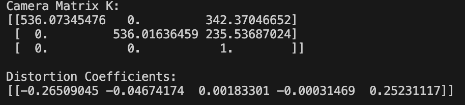
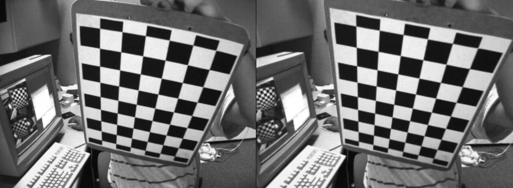
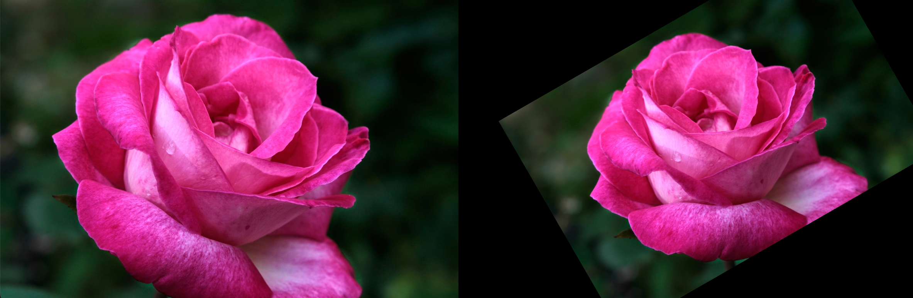
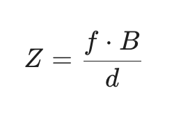
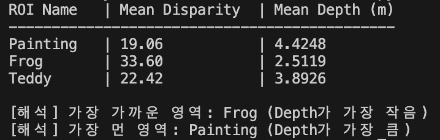
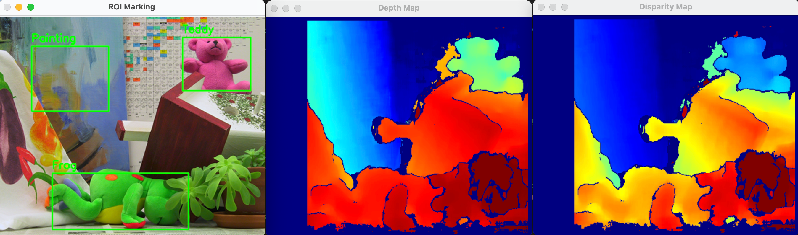

# 📂 OpenCV 실습
## 01. 체크보드 기반 카메라 캘리브레이션
[Camera Calibration & Image Undistortion]

### 1. 문제 설명

체크보드 패턴이 촬영된 여러 장의 이미지를 분석하여 카메라의 내부 파라미터(K)와 왜곡 계수(Distortion Coefficients)를 추정합니다.

검출된 파라미터를 바탕으로 렌즈에 의해 왜곡된 이미지를 평면으로 보정(Undistortion)하여 시각화합니다.

### 2. 코드

```Python
import cv2 # OpenCV 라이브러리 임포트
import numpy as np # 수치 계산을 위한 numpy 임포트
import glob # 파일 경로 패턴 매칭을 위한 glob 임포트

# 체크보드 내부 코너 개수 (가로, 세로)
CHECKERBOARD = (9, 6)

# 체크보드 한 칸 실제 크기 (mm)
square_size = 25.0

# 코너 정밀화 조건
criteria = (cv2.TERM_CRITERIA_EPS + cv2.TERM_CRITERIA_MAX_ITER, 30, 0.001)

# 실제 좌표 생성 (3D world points)
objp = np.zeros((CHECKERBOARD[0]*CHECKERBOARD[1], 3), np.float32) # (0,0,0), (1,0,0)...
objp[:, :2] = np.mgrid[0:CHECKERBOARD[0], 0:CHECKERBOARD[1]].T.reshape(-1, 2) # x, y 좌표 생성
objp *= square_size # 실제 크기로 스케일링

# 저장할 좌표 리스트
objpoints = [] # 실제 세계의 3D 점들
imgpoints = [] # 이미지 상의 2D 점들

# 이미지 경로 설정
images = glob.glob("0312/calibration_images/left*.jpg")

img_size = None # 이미지 크기 (width, height) - 첫 번째 이미지에서 추출하여 사용

# -----------------------------
# 1. 체크보드 코너 검출
# -----------------------------
for fname in images: # 이미지 파일 경로 반복
    img = cv2.imread(fname) # 이미지 로드
    gray = cv2.cvtColor(img, cv2.COLOR_BGR2GRAY) # 그레이스케일 변환
    
    if img_size is None: # 첫 번째 이미지에서 크기 추출
        img_size = gray.shape[::-1] # (width, height)

    # 이미지에서 체크보드 코너 찾기
    ret, corners = cv2.findChessboardCorners(gray, CHECKERBOARD, None)

    # 코너가 검출된 경우에만 데이터 추가
    if ret == True:
        objpoints.append(objp)

        # 코너 좌표 정밀화 (Sub-pixel accuracy)
        corners2 = cv2.cornerSubPix(gray, corners, (11, 11), (-1, -1), criteria)
        imgpoints.append(corners2) # 이미지 상의 2D 점들 저장

cv2.destroyAllWindows() # 모든 OpenCV 창 닫기

# -----------------------------
# 2. 카메라 캘리브레이션
# -----------------------------
# 카메라 행렬 K와 왜곡 계수 dist 계산
ret, K, dist, rvecs, tvecs = cv2.calibrateCamera(objpoints, imgpoints, img_size, None, None)

print("Camera Matrix K:") # 카메라 행렬 K 출력
print(K)

print("\nDistortion Coefficients:") # 왜곡 계수 dist 출력
print(dist)

# -----------------------------
# 3. 왜곡 보정 시각화
# -----------------------------
# 사용자가 요청한 이미지 로드
target_image = "0312/calibration_images/left02.jpg"
img = cv2.imread(target_image)

if img is not None:
    # 이미지 왜곡 보정
    dst = cv2.undistort(img, K, dist, None, K)

    # 원본과 결과 비교를 위해 가로로 이어 붙이기
    result = np.hstack((img, dst))
    
    cv2.imshow('Distortion Correction (Original vs Undistorted)', result) # 결과 시각화
    print(f"\n{target_image} 이미지가 성공적으로 보정되었습니다.") # 성공 메시지 출력
    cv2.waitKey(0) # 키 입력 대기
    cv2.destroyAllWindows() # 모든 OpenCV 창 닫기
else:
    print(f"이미지를 찾을 수 없습니다: {target_image}") # 이미지 로드 실패 메시지 출력

```
### 3. 해결 방법

코너 검출: cv2.findChessboardCorners()를 통해 격자 패턴을 찾고, cv2.cornerSubPix()로 서브픽셀 단위의 정밀한 좌표를 획득합니다.

파라미터 추정: 3D 실제 좌표와 2D 이미지 좌표의 대응 관계를 이용해 cv2.calibrateCamera()로 내부 행렬(K)과 왜곡 계수를 계산합니다.

이미지 보정: 계산된 왜곡 계수를 cv2.undistort() 함수에 적용하여 렌즈의 배럴 왜곡 등을 제거합니다.

### 4. 출력 결과



## 02. 이미지 Rotation & Transformation
[Image Geometry & Affine Transformation]

### 1. 문제 설명

한 장의 원본 이미지에 대해 회전(Rotation), 크기 조절(Scaling), 평행이동(Translation)을 동시에 적용하는 아핀 변환을 실습합니다.

이미지 중심을 기준으로 +30도 회전, 0.8배 축소, 그리고 (x+80, y-40)만큼 이동시킨 결과를 출력합니다.

### 2. 코드

```Python
import cv2 # OpenCV 라이브러리 임포트
import numpy as np # 수치 계산을 위한 numpy 임포트

# 1. 이미지 로드
img = cv2.imread('0312/rose.png') 

if img is None:
    print("이미지를 찾을 수 없습니다. 파일명을 확인해 주세요.") # 이미지 로드 실패 메시지 출력
else:
    h, w = img.shape[:2] # 이미지 높이(h)와 너비(w) 추출
    
    # -----------------------------
    # 2. 변환 행렬 생성 (회전 & 크기 조절)
    # -----------------------------
    # 이미지의 중심점 계산
    center = (w // 2, h // 2)
    
    # cv2.getRotationMatrix2D(중심, 각도, 스케일)
    # +30도 회전, 0.8배 크기 조절
    M = cv2.getRotationMatrix2D(center, 30, 0.8)
    
    # -----------------------------
    # 3. 평행이동 반영 (Translation)
    # -----------------------------
    # 힌트: 회전 행렬의 마지막 열(tx, ty) 값을 조정
    # x축 방향으로 +80px, y축 방향으로 -40px 이동
    M[0, 2] += 80
    M[1, 2] -= 40
    
    # -----------------------------
    # 4. 아핀 변환 적용
    # -----------------------------
    # cv2.warpAffine(이미지, 변환행렬, 결과이미지크기)
    dst = cv2.warpAffine(img, M, (w, h))
    
    # -----------------------------
    # 5. 결과 시각화
    # -----------------------------
    # 원본과 결과를 가로로 붙여서 출력
    combined = np.hstack((img, dst))

    cv2.imshow('Image Transformation (Original vs Result)', combined) # 결과 시각화
    cv2.waitKey(0) # 키 입력 대기
    cv2.destroyAllWindows() # 모든 OpenCV 창 닫기
```
### 3. 해결 방법

변환 행렬 구성: cv2.getRotationMatrix2D()를 사용하여 회전과 스케일링이 포함된 2×3 변환 행렬을 생성합니다.

이동 연산 결합: 생성된 변환 행렬의 마지막 열(tx,ty) 값을 직접 수정하여 평행이동 효과를 추가합니다.

아핀 변환: cv2.warpAffine() 함수를 통해 기하학적 변환을 최종 이미지에 적용합니다.

### 4. 출력 결과


## 03. Stereo Disparity 기반 Depth 추정
[Stereo Vision & Depth Estimation]

### 1. 문제 설명

좌우 두 대의 카메라(Stereo Camera)에서 촬영된 이미지의 변위(Disparity)를 계산하여 물체와의 실제 거리(Depth)를 추정합니다.

특정 관심 영역(ROI - Painting, Frog, Teddy)에 대해 평균 Disparity와 Depth 값을 산출하고, 어떤 물체가 가장 가까운지 분석합니다.

### 2. 코드

```Python
import cv2 # OpenCV 라이브러리 임포트
import numpy as np # 수치 계산을 위한 numpy 임포트
from pathlib import Path # 파일 경로 관리를 위한 pathlib 임포트

# 출력 폴더 생성
output_dir = Path("./outputs")
output_dir.mkdir(parents=True, exist_ok=True) # outputs 폴더가 없으면 생성

# 좌/우 이미지 불러오기 (파일 경로를 확인해 주세요)
left_color = cv2.imread("0312/left.png")
right_color = cv2.imread("0312/right.png")

if left_color is None or right_color is None: # 이미지 로드 실패 시 예외 처리
    raise FileNotFoundError("좌/우 이미지를 찾지 못했습니다. '0312/left.png', '0312/right.png' 파일을 확인하세요.")

# 카메라 파라미터
f = 700.0  # focal length
B = 0.12   # baseline (m)

# ROI 설정 (x, y, w, h)
rois = {
    "Painting": (55, 50, 130, 110),
    "Frog": (90, 265, 230, 95),
    "Teddy": (310, 35, 115, 90)
}

# -----------------------------
# 그레이스케일 변환
# -----------------------------
left_gray = cv2.cvtColor(left_color, cv2.COLOR_BGR2GRAY) # StereoBM은 그레이스케일 입력 필요
right_gray = cv2.cvtColor(right_color, cv2.COLOR_BGR2GRAY)

# -----------------------------
# 1. Disparity 계산
# -----------------------------
# StereoBM 알고리즘 객체 생성
stereo = cv2.StereoBM_create(numDisparities=64, blockSize=15)

# disparity map 계산 (16배 스케일된 정수형 반환)
disparity_raw = stereo.compute(left_gray, right_gray)

# 실수형 변환 후 16으로 나누어 실제 disparity 값 획득
disparity = disparity_raw.astype(np.float32) / 16.0

# -----------------------------
# 2. Depth 계산 (Z = fB / d)
# -----------------------------
depth_map = np.zeros_like(disparity) # 깊이 맵 초기화
valid_mask = disparity > 0  # 0보다 큰 픽셀만 사용

# 유효한 영역에 대해서만 Depth 계산
depth_map[valid_mask] = (f * B) / disparity[valid_mask]

# -----------------------------
# 3. ROI별 평균 disparity / depth 계산
# -----------------------------
results = {} # ROI별 결과 저장 딕셔너리
for name, (x, y, w, h) in rois.items(): # 각 ROI에 대해
    roi_disp = disparity[y:y+h, x:x+w] # ROI 영역의 disparity 슬라이싱
    roi_depth = depth_map[y:y+h, x:x+w] # ROI 영역의 depth 슬라이싱
    roi_mask = valid_mask[y:y+h, x:x+w] # ROI 영역의 유효한 픽셀 마스크 (disparity > 0)
    
    # 유효한 픽셀에 대해서만 평균값 계산
    if np.any(roi_mask):
        mean_disp = np.mean(roi_disp[roi_mask]) # 유효한 disparity 픽셀의 평균
        mean_depth = np.mean(roi_depth[roi_mask]) # 유효한 depth 픽셀의 평균
    else:
        mean_disp, mean_depth = 0, 0 # 유효한 픽셀이 없는 경우 0으로 설정
        
    results[name] = {"mean_disp": mean_disp, "mean_depth": mean_depth} # 결과 저장

# -----------------------------
# 4. 결과 출력 및 해석
# -----------------------------
print(f"{'ROI Name':<10} | {'Mean Disparity':<15} | {'Mean Depth (m)':<15}") # 결과 표 헤더 출력
print("-" * 45)
for name, data in results.items(): # 각 ROI의 이름과 평균 disparity, 평균 depth 출력
    print(f"{name:<10} | {data['mean_disp']:<15.2f} | {data['mean_depth']:<15.4f}")

# 해석: Depth가 가장 작은 영역이 가장 가까움
closest_roi = min(results, key=lambda k: results[k]['mean_depth']) # Depth가 가장 작은 ROI 찾기
farthest_roi = max(results, key=lambda k: results[k]['mean_depth']) # Depth가 가장 큰 ROI 찾기

print(f"\n[해석] 가장 가까운 영역: {closest_roi} (Depth가 가장 작음)")
print(f"[해석] 가장 먼 영역: {farthest_roi} (Depth가 가장 큼)")

# -----------------------------
# 5. disparity 시각화 (제공된 템플릿 코드 사용)
# -----------------------------
disp_tmp = disparity.copy()
disp_tmp[disp_tmp <= 0] = np.nan
d_min = np.nanpercentile(disp_tmp, 5)
d_max = np.nanpercentile(disp_tmp, 95)
disp_scaled = (disp_tmp - d_min) / (d_max - d_min)
disp_scaled = np.clip(disp_scaled, 0, 1)

disp_vis = np.zeros_like(disparity, dtype=np.uint8)
valid_disp = ~np.isnan(disp_tmp)
disp_vis[valid_disp] = (disp_scaled[valid_disp] * 255).astype(np.uint8)
disparity_color = cv2.applyColorMap(disp_vis, cv2.COLORMAP_JET)

# -----------------------------
# 6. depth 시각화 (제공된 템플릿 코드 사용)
# -----------------------------
depth_vis = np.zeros_like(depth_map, dtype=np.uint8)
if np.any(valid_mask):
    depth_valid = depth_map[valid_mask]
    z_min, z_max = np.percentile(depth_valid, 5), np.percentile(depth_valid, 95)
    depth_scaled = (depth_map - z_min) / (z_max - z_min)
    depth_scaled = 1.0 - np.clip(depth_scaled, 0, 1) # 가까울수록 빨간색(높은값) 유도
    depth_vis[valid_mask] = (depth_scaled[valid_mask] * 255).astype(np.uint8)
depth_color = cv2.applyColorMap(depth_vis, cv2.COLORMAP_JET)

# -----------------------------
# 7. Left / Right 이미지에 ROI 표시
# -----------------------------
left_vis = left_color.copy() # ROI 표시를 위한 복사본 생성
for name, (x, y, w, h) in rois.items(): # 각 ROI에 대해
    cv2.rectangle(left_vis, (x, y), (x + w, y + h), (0, 255, 0), 2) # ROI 영역에 초록색 사각형 그리기
    cv2.putText(left_vis, name, (x, y - 8), cv2.FONT_HERSHEY_SIMPLEX, 0.6, (0, 255, 0), 2) # ROI 이름 텍스트 추가

# -----------------------------
# 8. 저장 및 출력
# -----------------------------
cv2.imwrite(str(output_dir / "disparity_map.png"), disparity_color) # disparity 맵 저장
cv2.imwrite(str(output_dir / "depth_map.png"), depth_color) # depth 맵 저장
cv2.imwrite(str(output_dir / "roi_result.png"), left_vis) # ROI 결과 이미지 저장

cv2.imshow("Disparity Map", disparity_color) # disparity 맵 시각화
cv2.imshow("Depth Map", depth_color) # depth 맵 시각화
cv2.imshow("ROI Marking", left_vis) # ROI 마킹 시각화
cv2.waitKey(0) # 키 입력 대기
cv2.destroyAllWindows() # 모든 OpenCV 창 닫기
```
### 3. 해결 방법

Disparity Map 생성: cv2.StereoBM_create()를 통해 좌우 영상의 픽셀 차이를 계산하고, 16배 스케일링된 정수 값을 실수로 보정합니다.

거리 산출 공식: 렌즈의 초점 거리(f)와 두 카메라 사이의 거리(B), 변위(d)를 이용하여


 
공식을 적용합니다.

영역 분석: ROI 슬라이싱을 통해 개별 물체의 거리를 측정하며, Disparity가 클수록 물체는 더 가깝다는 원리를 확인합니다.

### 4. 출력 결과

