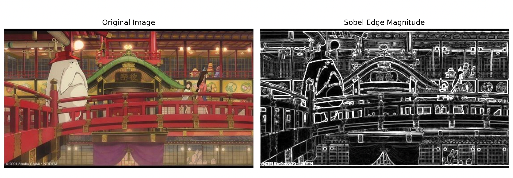
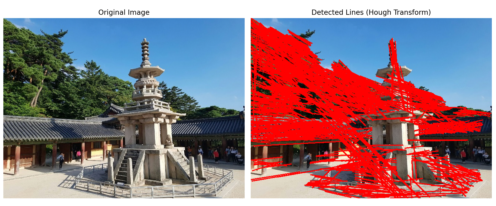
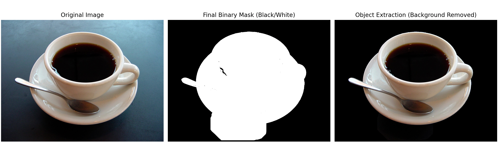
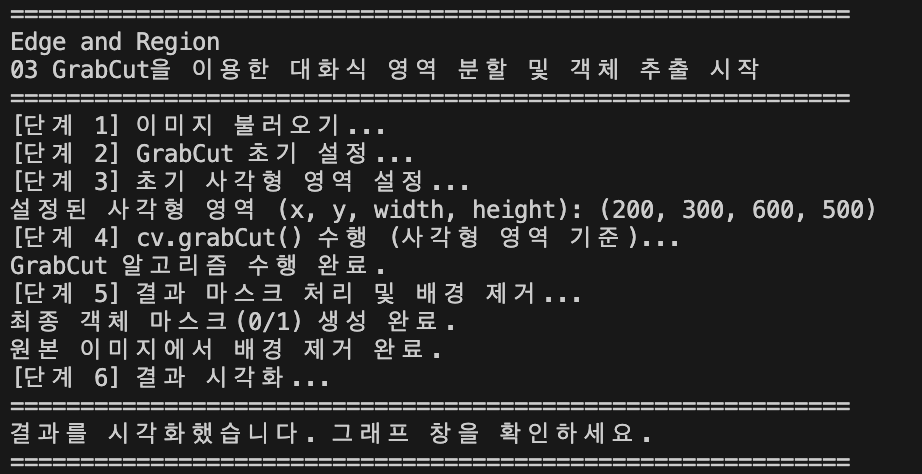

# 📂 OpenCV 실습
## 01. 소벨 에지 검출 및 결과 시각화
[Sobel Edge Detection & Visualization]

### 1. 문제 설명

입력 이미지를 그레이스케일로 변환한 후, 소벨(Sobel) 필터를 사용하여 x축과 y축 방향의 에지를 각각 검출합니다.
검출된 두 방향의 에지를 결합하여 에지 강도(Magnitude)를 계산하고, 이를 8비트 이미지 형식으로 변환하여 원본과 비교 시각화합니다.

### 2. 코드
```python
import cv2 # OpenCV 라이브러리
import numpy as np # 수치 계산을 위한 NumPy 라이브러리
from matplotlib import pyplot as plt # 시각화를 위한 Matplotlib 라이브러리

# 1. cv.imread()를 사용하여 이미지 불러오기
img = cv2.imread('0319/edgeDetectionImage.jpg')

if img is None: # 이미지가 제대로 불러와졌는지 확인
    print("이미지를 불러올 수 없습니다. 경로를 확인하세요.")
else:
    # 2. cv.cvtColor()를 사용하여 그레이스케일로 변환
    gray = cv2.cvtColor(img, cv2.COLOR_BGR2GRAY)

    # 3. cv.Sobel()을 사용하여 x축과 y축 방향의 에지 검출
    sobelx = cv2.Sobel(gray, cv2.CV_64F, 1, 0, ksize=3) # x축 방향의 에지 검출
    sobely = cv2.Sobel(gray, cv2.CV_64F, 0, 1, ksize=3) # y축 방향의 에지 검출

    # 4. cv.magnitude()를 사용하여 에지 강도(magnitude) 계산
    magnitude = cv2.magnitude(sobelx, sobely)

    # 5. 힌트: cv.convertScaleAbs()를 사용하여 uint8로 변환
    # 시각화를 위해 절대값을 취하고 8비트 형식으로 바꾼다.
    sobel_abs = cv2.convertScaleAbs(magnitude)

    # 6. Matplotlib를 사용하여 원본 이미지와 에지 강도 이미지를 나란히 시각화
    plt.figure(figsize=(12, 6))

    # 원본 이미지 출력 (RGB로 변환 필요)
    plt.subplot(1, 2, 1)  # 원본 이미지 시각화
    plt.imshow(cv2.cvtColor(img, cv2.COLOR_BGR2RGB))
    plt.title('Original Image')
    plt.axis('off')

    # 에지 강도 이미지 출력 (그레이스케일로 시각화)
    plt.subplot(1, 2, 2)  # 에지 강도 이미지 시각화
    plt.imshow(sobel_abs, cmap='gray') # 에지 강도 이미지는 그레이스케일로 시각화
    plt.title('Sobel Edge Magnitude')
    plt.axis('off')

    plt.tight_layout() # 그래프 간격 조정
    plt.show() # 시각화된 결과 출력
```

### 3. 해결 방법

에지 검출: cv2.Sobel() 함수를 사용하여 x방향(dx=1,dy=0)과 y방향(dx=0,dy=1)의 기울기를 계산합니다. 이때 정밀도를 위해 cv2.CV_64F 타입을 사용합니다.

강도 계산: cv2.magnitude()를 통해 두 방향의 기울기를 합성하여 전체 에지 강도를 구합니다.

데이터 변환: 계산된 실수형 데이터를 시각화하기 위해 cv2.convertScaleAbs()를 사용하여 uint8 형식으로 변환합니다.

### 4. 출력 결과


## 02. 캐니 에지 및 허프 변환을 이용한 직선 검출
[Canny Edge & Hough Transform Line Detection]

### 1. 문제 설명

이미지에서 유의미한 구조적 선을 찾기 위해 캐니 에지(Canny Edge) 검출기로 에지 맵을 생성합니다.
생성된 에지 맵을 바탕으로 확률적 허프 변환(HoughLinesP) 알고리즘을 적용하여 직선 성분을 추출하고, 검출된 직선들을 원본 이미지 위에 붉은색 선으로 그려 시각화합니다.

### 2. 코드
```python
import cv2 # OpenCV 라이브러리
import numpy as np # 수치 계산을 위한 NumPy 라이브러리
from matplotlib import pyplot as plt # 시각화를 위한 Matplotlib 라이브러리

# 1. 이미지 불러오기
img = cv2.imread('0319/dabo.jpg')

if img is None: # 이미지가 제대로 불러와졌는지 확인
    print("이미지를 불러올 수 없습니다. 경로와 파일명을 확인하세요.")
else:
    # 원본 복사본 생성 (직선을 그릴 용도)
    line_img = img.copy()
    
    # 그레이스케일 변환 (에지 검출을 위한 전처리)
    gray = cv2.cvtColor(img, cv2.COLOR_BGR2GRAY)

    # 2. cv.Canny()를 사용하여 에지 맵 생성
    edges = cv2.Canny(gray, 100, 200)

    # 3. cv.HoughLinesP()를 사용하여 직선 검출
    # 파라미터(rho, theta, threshold, minLineLength, maxLineGap)는 
    # 이미지 특성에 따라 조정이 필요하지만, 일반적인 기본값을 설정했습니다.
    lines = cv2.HoughLinesP(edges, rho=1, theta=np.pi/180, threshold=50, 
                            minLineLength=50, maxLineGap=10)

    # 4. cv.line()을 사용하여 검출된 직선을 원본 이미지에 그리기
    if lines is not None:
        for line in lines:
            x1, y1, x2, y2 = line[0] # HoughLinesP는 각 직선을 (x1, y1, x2, y2) 형태로 반환
            cv2.line(line_img, (x1, y1), (x2, y2), (0, 0, 255), 2) # 빨간색(0, 0, 255)으로 두께 2의 선을 그립니다.

    # 5. Matplotlib를 사용하여 시각화
    plt.figure(figsize=(12, 6))

    # 원본 이미지 (BGR -> RGB 변환)
    plt.subplot(1, 2, 1) # 원본 이미지 시각화
    plt.imshow(cv2.cvtColor(img, cv2.COLOR_BGR2RGB)) # OpenCV는 BGR 형식이므로 RGB로 변환하여 시각화
    plt.title('Original Image')
    plt.axis('off')

    # 직선이 그려진 결과 이미지 (BGR -> RGB 변환)
    plt.subplot(1, 2, 2) # 검출된 직선이 그려진 이미지 시각화
    plt.imshow(cv2.cvtColor(line_img, cv2.COLOR_BGR2RGB)) # 검출된 직선이 그려진 이미지 시각화
    plt.title('Detected Lines (Hough Transform)')
    plt.axis('off')

    plt.tight_layout() # 그래프 간격 조정
    plt.show() # 시각화된 결과 출력
```

### 3. 해결 방법

에지 추출: cv2.Canny()를 사용하며, 임계값(Threshold)을 100과 200으로 설정하여 노이즈를 제거하고 강한 에지만 추출합니다.

직선 검출: cv2.HoughLinesP()를 사용하여 선분의 시작점과 끝점 좌표를 획득합니다. minLineLength와 maxLineGap 파라미터를 조절하여 검출 성능을 최적화합니다.

결과 그리기: 검출된 좌표를 cv2.line() 함수에 전달하여 원본 이미지의 복사본 위에 두께 2의 빨간색(0, 0, 255) 선을 그립니다.

### 4. 출력 결과


## 03. GrabCut을 이용한 대화식 영역 분할 및 객체 추출
[Interactive Segmentation using GrabCut]

### 1. 문제 설명

사용자가 지정한 사각형(Rectangle) 영역 정보를 바탕으로 GrabCut 알고리즘을 실행하여 배경과 객체를 분리합니다.
알고리즘이 내뱉은 마스크 정보를 가공하여 확실한 전경과 배경을 구분하고, 최종적으로 원본 이미지에서 배경을 완전히 제거한 객체(커피잔 등)만 추출하여 출력합니다.

### 2. 코드
```python
import cv2 # OpenCV 라이브러리
import numpy as np # 수치 계산을 위한 NumPy 라이브러리
from matplotlib import pyplot as plt # 시각화를 위한 Matplotlib 라이브러리
import matplotlib.colors as mcolors # 컬러맵 정의를 위한 Matplotlib의 colors 모듈

# ==============================================================================
# Edge and Region - 03 GrabCut을 이용한 대화식 영역 분할 및 객체 추출
# ==============================================================================

# * coffee cup 이미지로 사용자가 지정한 사각형 영역을 바탕으로 GrabCut 알고리즘을 사용하여 객체 추출
# * 객체 추출 결과를 마스크 형태로 시각화
# * 원본 이미지에서 배경을 제거하고 객체만 남은 이미지 출력

print("="*60)
print("Edge and Region")
print("03 GrabCut을 이용한 대화식 영역 분할 및 객체 추출 시작")
print("="*60)

# **[단계 1] 이미지 불러오기**
print("[단계 1] 이미지 불러오기...")
img = cv2.imread('0319/coffee cup.JPG') 

if img is None: # 이미지가 제대로 불러와졌는지 확인
    print("이미지를 불러올 수 없습니다. 경로를 확인하세요.")
    exit()

# **[단계 2] GrabCut 초기 설정**
print("[단계 2] GrabCut 초기 설정...")
# 마스크를 원본 이미지와 같은 크기로 생성
mask = np.zeros(img.shape[:2], np.uint8) # GrabCut 알고리즘에서 사용할 마스크 (2D, uint8)
bgdModel = np.zeros((1, 65), np.float64) # 배경 모델 (1x65, float64)
fgdModel = np.zeros((1, 65), np.float64) # 전경 모델 (1x65, float64)

# **[단계 3] 초기 사각형 영역 설정**
print("[단계 3] 초기 사각형 영역 설정...")
# 초기 사각형 영역은 (x, y, width, height) 형식으로 설정
# 시연용 이미지의 중앙 커피잔을 감싸는 영역
# 이미지의 높이(h)와 너비(w)를 가져옵니다.
h, w = img.shape[:2]

# 이미지 전체에서 테두리 10픽셀 정도만 제외하고 사각형을 잡습니다.
# (x, y, width, height) 순서입니다.
rect = (10, 10, w - 20, h - 20) 

print(f"이미지 크기: {w}x{h}")
print(f"설정된 사각형 영역: {rect}")

# **[단계 4] cv.grabCut()을 사용하여 대화식 분할 수행**
print("[단계 4] cv.grabCut() 수행 (사각형 영역 기준)...")
cv2.grabCut(img, mask, rect, bgdModel, fgdModel, 5, cv2.GC_INIT_WITH_RECT) # 초기 사각형 영역을 기준으로 GrabCut 알고리즘 수행
print("GrabCut 알고리즘 수행 완료.")

# **[단계 5] 결과 마스크 처리 및 배경 제거**
print("[단계 5] 결과 마스크 처리 및 배경 제거...")
# GrabCut 수행 후 mask는 0~3 값을 가짐:
# 0: certain background, 1: certain foreground, 2: probable background, 3: probable foreground

# np.where()를 사용하여 마스크 값을 0 또는 1로 변경
# 확실한 전경(1)과 전경으로 추정되는 영역(3)은 1로, 나머지는 0으로 설정
# (mask==2) | (mask==0) 이면 0(배경), 아니면 1(객체)
mask2 = np.where((mask==2)|(mask==0), 0, 1).astype('uint8')
print("최종 객체 마스크(0/1) 생성 완료.")

# 마스크를 사용하여 원본 이미지에서 배경을 제거
# `numpy`의 broadcasting을 사용하여 원본 이미지에 최종 마스크 곱하기
# mask2는 2D이므로 3D로 확장하여 원본 이미지에 곱함
img_fg = img * mask2[:,:,np.newaxis]
print("원본 이미지에서 배경 제거 완료.")

# **[단계 6] 결과 시각화**
print("[단계 6] 결과 시각화...")

# 시각화를 위한 헬퍼 함수
def bgr_to_rgb(img_bgr):
    return cv2.cvtColor(img_bgr, cv2.COLOR_BGR2RGB)

# 마스크 값을 시각적으로 명확하게 구분하기 위해 커스텀 컬러맵 정의
# 0: 검은색 (확실한 배경), 1: 노란색 (확실한 전경), 2: 파란색 (추정 배경), 3: 하늘색 (추정 전경)
colors = ['black', 'yellow', 'blue', 'cyan']
levels = [0, 1, 2, 3]
cmap_custom = mcolors.ListedColormap(colors) # 커스텀 컬러맵 생성
norm_custom = mcolors.BoundaryNorm(levels + [4], cmap_custom.N) # 마스크 값에 따른 컬러맵 정규화

plt.figure(figsize=(18, 6)) # 그래프 크기 설정

# matplotlib를 사용하여 세 개의 이미지를 나란히 시각화

# (1) 원본 이미지
plt.subplot(1, 3, 1)
plt.imshow(bgr_to_rgb(img))
plt.title('Original Image')
plt.axis('off')

# (2) GrabCut 마스크 (4단계 분류)
plt.subplot(1, 3, 2)
# mask(0~3 값) 대신, 우리가 배경을 지우려고 만든 mask2(0 또는 1)를 출력합니다.
plt.imshow(mask2, cmap='gray') 
plt.title('Final Binary Mask (Black/White)')
plt.axis('off')

# (3) 배경 제거 이미지 (최종 객체 추출 결과)
plt.subplot(1, 3, 3) # 배경이 제거된 이미지 시각화
plt.imshow(bgr_to_rgb(img_fg)) # BGR -> RGB 변환
plt.title('Object Extraction (Background Removed)')
plt.axis('off')

plt.tight_layout()
print("="*60)
print("결과를 시각화했습니다. 그래프 창을 확인하세요.")
print("="*60)
plt.show()
```

### 3. 해결 방법

초기화: 객체를 포함하는 사각형 영역(rect)을 정의하고, 알고리즘 내부 연산에 필요한 bgdModel, fgdModel을 np.zeros로 초기화합니다.

영역 분할: cv2.grabCut() 함수를 cv2.GC_INIT_WITH_RECT 모드로 실행하여 5회 반복 연산을 수행합니다.

마스크 가공: 결과 마스크에서 배경(0)과 배경 추정(2) 영역을 np.where()를 사용하여 0으로 만들고, 나머지를 1로 설정하여 이진 마스크를 생성합니다.

객체 추출: 생성된 이진 마스크를 원본 이미지와 비트 단위 곱셈(또는 행렬 곱)을 통해 배경을 검은색으로 처리합니다.

### 4. 출력 결과

