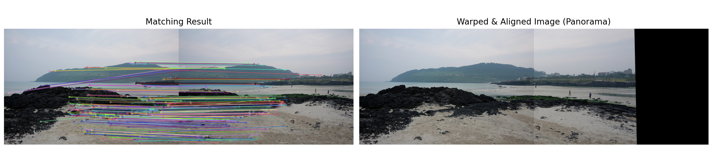

# 📂 OpenCV 실습
## 01. SIFT를 이용한 특징점 검출 및 시각화
[SIFT Keypoint Detection & Visualization]

### 1. 문제 설명

입력 이미지를 불러와 SIFT(Scale-Invariant Feature Transform) 알고리즘을 사용하여 크기와 회전에 불변하는 특징점(Keypoints)을 검출합니다.
검출된 특징점의 위치, 크기, 방향 정보를 원본 이미지 위에 시각화하여 알고리즘이 이미지의 어느 부분을 유의미한 특징으로 인식했는지 확인합니다.

### 2. 코드
```python
import cv2 # OpenCV 라이브러리 임포트
import matplotlib.pyplot as plt # 시각화를 위한 Matplotlib 라이브러리 임포트

# 1. 이미지 불러오기
image_path = 'mot_color70.jpg' 
img = cv2.imread(image_path)

if img is None: # 이미지가 제대로 불러와졌는지 확인
    print(f"오류: '{image_path}' 이미지를 찾을 수 없습니다. 경로를 확인해주세요.")
else:
    # OpenCV는 BGR 형태로 이미지를 읽으므로 Matplotlib 출력을 위해 RGB로 변환
    img_rgb = cv2.cvtColor(img, cv2.COLOR_BGR2RGB)
    
    # 특징점 검출을 위해 흑백 이미지로 변환 (필수는 아니지만 일반적으로 연산 속도와 효율을 위해 사용)
    img_gray = cv2.cvtColor(img, cv2.COLOR_BGR2GRAY)

    # 2. SIFT 객체 생성 
    sift = cv2.SIFT_create()

    # 3. 특징점 검출 및 특징 디스크립터 계산
    keypoints, descriptors = sift.detectAndCompute(img_gray, None)

    # 4. 특징점 시각화 
    img_keypoints = cv2.drawKeypoints(
        img_rgb, 
        keypoints, 
        None, 
        flags=cv2.DRAW_MATCHES_FLAGS_DRAW_RICH_KEYPOINTS
    )

    # 5. matplotlib을 이용한 결과 출력 
    plt.figure(figsize=(15, 7)) # 전체 창 크기 설정

    # 왼쪽: 원본 이미지
    plt.subplot(1, 2, 1)
    plt.imshow(img_rgb)
    plt.title('Original Image')
    plt.axis('off')

    # 오른쪽: 특징점이 시각화된 이미지
    plt.subplot(1, 2, 2)
    plt.imshow(img_keypoints)
    plt.title(f'SIFT Keypoints (Total: {len(keypoints)})')
    plt.axis('off')

    plt.tight_layout() # 서브플롯 간의 간격을 자동으로 조정하여 레이아웃을 깔끔하게 만듭니다.
    plt.show() # 그래프 창을 띄워서 결과를 시각화
```

### 3. 해결 방법

객체 생성 및 특징점 검출: cv2.SIFT_create() 함수로 SIFT 객체를 생성하고, detectAndCompute() 메서드를 사용하여 이미지 내의 특징점과 각 특징점의 디스크립터를 추출합니다. 필요에 따라 nfeatures 매개변수로 검출 개수를 제한할 수 있습니다.

그레이스케일 활용: 특징점 검출 시 연산 효율성을 높이기 위해 원본 BGR 이미지를 cv2.cvtColor()를 사용해 그레이스케일로 변환한 후 입력으로 사용합니다.

풍부한 시각화 적용: cv2.drawKeypoints() 함수를 호출할 때 flags=cv2.DRAW_MATCHES_FLAGS_DRAW_RICH_KEYPOINTS 옵션을 설정하여, 단순한 점 형태가 아닌 특징점의 해당 영역 크기(원의 크기)와 주요 방향(원 안의 선)을 함께 시각화합니다.

### 4. 출력 결과


## 02. SIFT를 이용한 두 영상 간 특징점 매칭
[SIFT Feature Matching Between Two Images]

### 1. 문제 설명

두 개의 서로 다른 시점 또는 상태의 이미지를 입력받아 각각 SIFT 특징점과 디스크립터를 추출합니다.
추출된 두 이미지의 디스크립터 간 거리를 비교하여 서로 대응되는 특징점을 매칭하고, 오매칭을 최소화하기 위한 필터링을 거친 후 그 결과를 선으로 연결하여 시각화합니다.

### 2. 코드
```Python
import cv2 # OpenCV 라이브러리 임포트
import matplotlib.pyplot as plt # 시각화를 위한 Matplotlib 라이브러리 임포트

# 1. 두 개의 이미지 불러오기 
img1_path = 'mot_color70.jpg'
img2_path = 'mot_color83.jpg'

img1 = cv2.imread(img1_path) # 왼쪽 기준이 될 이미지
img2 = cv2.imread(img2_path) # 변환되어 오른쪽에 붙을 이미지

# 파일이 제대로 불러와졌는지 확인
if img1 is None or img2 is None:
    print("오류: 이미지를 찾을 수 없습니다. 터미널 경로와 파일 이름을 다시 확인해주세요.")
else:
    # Matplotlib 출력을 위해 BGR -> RGB 변환
    img1_rgb = cv2.cvtColor(img1, cv2.COLOR_BGR2RGB)
    img2_rgb = cv2.cvtColor(img2, cv2.COLOR_BGR2RGB)
    
    # SIFT 추출을 위해 흑백 이미지로 변환
    img1_gray = cv2.cvtColor(img1, cv2.COLOR_BGR2GRAY)
    img2_gray = cv2.cvtColor(img2, cv2.COLOR_BGR2GRAY)

    # 2. SIFT 객체 생성 및 특징점 추출 
    sift = cv2.SIFT_create()
    kp1, des1 = sift.detectAndCompute(img1_gray, None)
    kp2, des2 = sift.detectAndCompute(img2_gray, None)

    # 3. 특징점 매칭 
    # knnMatch()를 사용하여 최근접 이웃 거리 비율 적용 (정확도 향상)
    bf = cv2.BFMatcher(cv2.NORM_L2)
    matches = bf.knnMatch(des1, des2, k=2) # 가장 가까운 매칭점 2개를 찾음

    # 좋은 매칭점만 선별하기 (Lowe's ratio test)
    # 첫 번째로 가까운 점의 거리가 두 번째로 가까운 점의 거리의 75% 이하일 때만 유효한 매칭으로 인정
    good_matches = []
    for m, n in matches:
        if m.distance < 0.75 * n.distance:
            good_matches.append(m)

    # 4. 매칭 결과 시각화
    # drawMatches를 사용하여 두 이미지 간의 매칭 선을 그려줍니다.
    img_matches = cv2.drawMatches(
        img1_rgb, kp1, 
        img2_rgb, kp2, 
        good_matches, None, 
        flags=cv2.DrawMatchesFlags_NOT_DRAW_SINGLE_POINTS # 매칭되지 않은 점은 그리지 않음
    )

    # 5. matplotlib을 이용한 매칭 결과 출력 (요구사항 반영)
    plt.figure(figsize=(15, 7))
    plt.imshow(img_matches)
    plt.title(f'SIFT Feature Matching (Good Matches: {len(good_matches)})')
    plt.axis('off')
    plt.tight_layout() # 서브플롯 간의 간격을 자동으로 조정하여 레이아웃을 깔끔하게 만듭니다.
    plt.show() # 그래프 창을 띄워서 결과를 시각화
```

### 3. 해결 방법

최근접 이웃 매칭: cv2.BFMatcher()(Brute-Force Matcher) 객체를 생성하고 knnMatch() 함수를 사용하여 첫 번째 이미지의 각 특징점당 가장 거리가 가까운 두 개의 이웃 특징점을 두 번째 이미지에서 찾습니다.

비율 검사 (Lowe's Ratio Test): 매칭의 신뢰도를 높이기 위해, 첫 번째로 가까운 점의 거리가 두 번째로 가까운 점의 거리의 일정 비율(예: 75% 이하)일 때만 유의미한 매칭(Good Matches)으로 선별하여 오매칭(False Positive)을 제거합니다.

매칭 선 시각화: cv2.drawMatches() 함수를 사용하여 선별된 좋은 매칭점들만 선으로 연결하여 보여줍니다. 이때 NOT_DRAW_SINGLE_POINTS 플래그를 적용해 짝을 찾지 못한 특징점은 화면에서 숨겨 가독성을 높입니다.

### 4. 출력 결과


## 03. 호모그래피를 이용한 이미지 정합 (Image Alignment)
[Homography-based Image Alignment]

### 1. 문제 설명

SIFT를 통해 얻은 두 이미지 간의 매칭점 데이터를 바탕으로 투시 변환 관계인 호모그래피(Homography) 행렬을 계산합니다.
계산된 행렬을 이용해 한 이미지를 다른 이미지의 시점으로 기하학적 변환(Warping)을 수행하고, 두 이미지를 하나의 넓은 캔버스에 이어 붙여 파노라마(Panorama) 이미지를 생성합니다.

### 2. 코드
```Python
import cv2 # OpenCV 라이브러리 임포트
import numpy as np # 수치 계산을 위한 NumPy 라이브러리 임포트
import matplotlib.pyplot as plt # 시각화를 위한 Matplotlib 라이브러리 임포트

# 1. 두 개의 이미지 불러오기
img1_path = 'img1.jpg' # 왼쪽 기준이 될 이미지
img2_path = 'img2.jpg' # 변환되어 오른쪽에 붙을 이미지

img1 = cv2.imread(img1_path) # 왼쪽 기준이 될 이미지
img2 = cv2.imread(img2_path) # 변환되어 오른쪽에 붙을 이미지

if img1 is None or img2 is None: # 이미지가 제대로 불러와졌는지 확인
    print("오류: 이미지를 찾을 수 없습니다. 터미널 경로가 0326 폴더인지 확인해주세요.")
else:
    # Matplotlib 출력을 위해 BGR -> RGB 변환
    img1_rgb = cv2.cvtColor(img1, cv2.COLOR_BGR2RGB)
    img2_rgb = cv2.cvtColor(img2, cv2.COLOR_BGR2RGB)
    
    # SIFT 추출을 위해 흑백 이미지로 변환
    img1_gray = cv2.cvtColor(img1, cv2.COLOR_BGR2GRAY)
    img2_gray = cv2.cvtColor(img2, cv2.COLOR_BGR2GRAY)

    # 2. SIFT 객체 생성 및 특징점 추출
    sift = cv2.SIFT_create()
    kp1, des1 = sift.detectAndCompute(img1_gray, None) # img1에서 특징점과 디스크립터 추출
    kp2, des2 = sift.detectAndCompute(img2_gray, None) # img2에서 특징점과 디스크립터 추출

    # 3. 특징점 매칭 및 좋은 매칭점 선별
    bf = cv2.BFMatcher()
    matches = bf.knnMatch(des1, des2, k=2)

    # 거리 비율이 임계값(0.7) 미만인 매칭점만 선별
    good_matches = []
    for m, n in matches:
        if m.distance < 0.7 * n.distance:
            good_matches.append(m)

    # 매칭점 시각화 이미지 생성
    img_matching_result = cv2.drawMatches(
        img1_rgb, kp1, img2_rgb, kp2, good_matches, None, 
        flags=cv2.DrawMatchesFlags_NOT_DRAW_SINGLE_POINTS
    )

    # 호모그래피 계산을 위해서는 최소 4개의 매칭점이 필요합니다.
    if len(good_matches) >= 4:
        # 4. 호모그래피 행렬 계산
        # img2를 img1의 시점으로 변환하기 위해 src=img2, dst=img1로 설정
        src_pts = np.float32([kp2[m.trainIdx].pt for m in good_matches]).reshape(-1, 1, 2)
        dst_pts = np.float32([kp1[m.queryIdx].pt for m in good_matches]).reshape(-1, 1, 2)

        # cv.RANSAC을 사용하여 이상점(Outlier) 영향 줄이기
        H, mask = cv2.findHomography(src_pts, dst_pts, cv2.RANSAC, 5.0)

        # 5. 이미지 변환 및 정렬
        h1, w1 = img1_rgb.shape[:2] # img1의 높이와 너비
        h2, w2 = img2_rgb.shape[:2] # img2의 높이와 너비

        # 출력 크기를 두 이미지를 합친 파노라마 크기 (w1+w2, max(h1, h2))로 설정
        panorama_w = w1 + w2
        panorama_h = max(h1, h2)

        # img2를 호모그래피 행렬 H를 이용해 변환
        warped_img = cv2.warpPerspective(img2_rgb, H, (panorama_w, panorama_h))

        # 변환된 결과 캔버스 왼쪽에 원본 img1을 덮어씌워서 파노라마 완성
        warped_img[0:h1, 0:w1] = img1_rgb

        # 6. matplotlib을 이용하여 변환된 이미지와 매칭 결과 나란히 출력
        plt.figure(figsize=(18, 6))

        # 왼쪽: 매칭 결과 출력
        plt.subplot(1, 2, 1)
        plt.imshow(img_matching_result)
        plt.title('Matching Result')
        plt.axis('off')

        # 오른쪽: 호모그래피로 정합된 파노라마 이미지 출력
        plt.subplot(1, 2, 2)
        plt.imshow(warped_img)
        plt.title('Warped & Aligned Image (Panorama)')
        plt.axis('off')

        plt.tight_layout() # 서브플롯 간의 간격을 자동으로 조정하여 레이아웃을 깔끔하게 만듭니다.
        plt.show() # 그래프 창을 띄워서 결과를 시각화
    else:
        print(f"매칭점이 부족합니다. 최소 4개가 필요하지만 {len(good_matches)}개만 찾았습니다.")
```

### 3. 해결 방법

데이터 형태 변환 및 호모그래피 계산: 선별된 좋은 매칭점(최소 4개 이상 필요)의 좌표를 추출하여 NumPy 배열로 변환합니다. 이후 cv2.findHomography() 함수를 사용하여 두 이미지 간의 기하학적 변환 행렬을 구합니다.

RANSAC 알고리즘 적용: 호모그래피 계산 시 cv2.RANSAC 옵션을 추가하여, 비율 검사를 통과했음에도 남아있을 수 있는 잘못된 매칭점(Outlier)들이 변환 행렬 계산에 미치는 영향을 최소화합니다.

시점 변환 및 이미지 합성: cv2.warpPerspective() 함수에 구해진 호모그래피 행렬을 적용하여 변환될 이미지를 두 이미지의 너비가 합쳐진 넓은 캔버스에 투영합니다. 그 후 캔버스의 빈 영역에 기준 이미지를 덮어씌워 매끄러운 정합 결과를 완성합니다.

### 4. 출력 결과
