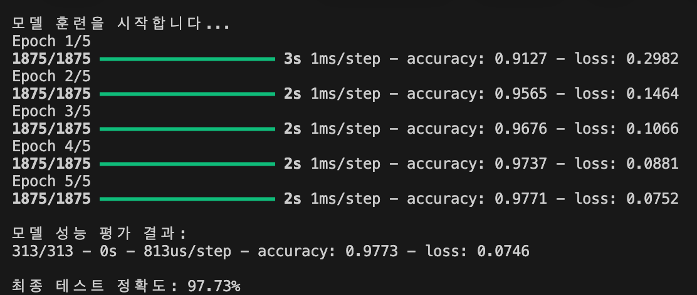
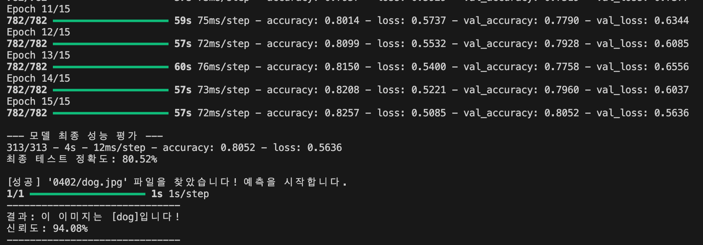

# 📂 Deep Learning 실습
## 01. 간단한 이미지 분류기 구현
[Simple Image Classifier Implementation]

### 1. 문제 설명

가장 기초적인 딥러닝 예제인 MNIST 데이터셋을 활용하여 0부터 9까지의 손글씨 숫자를 분류하는 모델을 구축합니다. 28x28 픽셀의 흑백 이미지를 입력받아 정규화 과정을 거친 후, 기본적인 완전 연결 신경망(Fully Connected Network)을 통해 각 숫자에 대한 확률을 예측하고 모델의 정확도를 평가합니다.

### 2. 코드

```Python
import tensorflow as tf # TensorFlow 라이브러리를 불러옵니다
from tensorflow.keras import layers, models # Keras의 레이어와 모델 클래스를 불러옵니다

# 1. MNIST 데이터셋 로드 및 훈련/테스트 세트로 분할
print("데이터를 로드 중입니다...")
mnist = tf.keras.datasets.mnist
(x_train, y_train), (x_test, y_test) = mnist.load_data() 

# 2. 데이터 전처리 (0~255 사이의 픽셀 값을 0~1 사이로 정규화)
x_train, x_test = x_train / 255.0, x_test / 255.0

# 3. Sequential 모델을 사용하여 신경망 구축
# Dense 레이어 활용
model = models.Sequential([
    # 28x28 2차원 배열을 1차원(784)으로 펼침
    layers.Flatten(input_shape=(28, 28)), 
    # 은닉층: 128개 노드, ReLU 활성화 함수
    layers.Dense(128, activation='relu'),
    # 과적합 방지를 위한 드롭아웃(선택 사항이나 권장됨)
    layers.Dropout(0.2),
    # 출력층: 10개 클래스(숫자 0~9), Softmax로 확률 출력
    layers.Dense(10, activation='softmax')
])

# 4. 모델 컴파일
model.compile(optimizer='adam',
              loss='sparse_categorical_crossentropy',
              metrics=['accuracy'])

# 5. 모델 훈련
print("\n모델 훈련을 시작합니다...")
model.fit(x_train, y_train, epochs=5)

# 6. 정확도 평가
print("\n모델 성능 평가 결과:")
loss, accuracy = model.evaluate(x_test, y_test, verbose=2)
print(f"\n최종 테스트 정확도: {accuracy*100:.2f}%")
```
### 3. 해결 방법

데이터 전처리: tf.keras.datasets.mnist를 통해 데이터를 로드하고, 픽셀 값(0~255)을 255.0으로 나누어 0~1 사이의 값으로 **정규화(Normalization)**합니다. 이는 모델의 수렴 속도를 높이는 데 필수적입니다.

신경망 구조 설계:

Flatten 레이어를 사용하여 2D 이미지 데이터를 1D 벡터(784차원)로 변환합니다.

128개의 노드를 가진 Dense 레이어와 ReLU 활성화 함수를 사용하여 특징을 추출합니다.

**Dropout(0.2)**을 적용하여 학습 시 일부 뉴런을 무작위로 비활성화함으로써 과적합(Overfitting)을 방지합니다.

컴파일 및 훈련: adam 옵티마이저와 sparse_categorical_crossentropy 손실 함수를 사용하여 모델을 설정하고, 5회(Epochs=5) 학습을 진행합니다.

### 4. 출력 결과


## 02. CIFAR-10 데이터셋을 활용한 CNN 모델 구축
[CNN Model Construction using CIFAR-10 dataset]

### 1. 문제 설명

10가지 카테고리(비행기, 자동차, 새 등)를 가진 컬러 이미지 데이터셋인 CIFAR-10을 분류하기 위해 **합성곱 신경망(CNN)**을 설계합니다. 단순한 신경망보다 복잡한 이미지 특징 추출에 최적화된 Conv2D 레이어와 성능 향상을 위한 다양한 기법(BatchNormalization, Dropout 등)을 적용하며, 학습된 모델로 외부 이미지(dog.jpg)를 직접 예측해 봅니다.

### 2. 코드

```Python
import tensorflow as tf # TensorFlow 라이브러리를 불러옵니다
from tensorflow.keras import layers, models # Keras의 레이어와 모델 클래스를 불러옵니다
import numpy as np # NumPy 라이브러리를 불러옵니다
import os # 운영체제 관련 기능을 사용하기 위한 os 모듈을 불러옵니다
from PIL import Image # 이미지 처리를 위한 PIL 라이브러리를 불러옵니다

# 1. 데이터셋 로드 및 정규화
print("CIFAR-10 데이터를 로드 중입니다...")
(x_train, y_train), (x_test, y_test) = tf.keras.datasets.cifar10.load_data()

# 0~255 값을 0~1 사이 소수점으로 변환
x_train = x_train.astype('float32') / 255.0
x_test = x_test.astype('float32') / 255.0

class_names = ['airplane', 'automobile', 'bird', 'cat', 'deer', 
               'dog', 'frog', 'horse', 'ship', 'truck'] 

# 2. 고성능 CNN 모델 설계 
# 레이어를 더 깊게 쌓고 BatchNormalization과 Dropout을 추가해 정확도를 높였습니다.
model = models.Sequential([
    # 첫 번째 블록
    layers.Conv2D(32, (3, 3), padding='same', activation='relu', input_shape=(32, 32, 3)),
    layers.BatchNormalization(),
    layers.Conv2D(32, (3, 3), padding='same', activation='relu'),
    layers.BatchNormalization(),
    layers.MaxPooling2D((2, 2)),
    layers.Dropout(0.2),

    # 두 번째 블록
    layers.Conv2D(64, (3, 3), padding='same', activation='relu'),
    layers.BatchNormalization(),
    layers.Conv2D(64, (3, 3), padding='same', activation='relu'),
    layers.BatchNormalization(),
    layers.MaxPooling2D((2, 2)),
    layers.Dropout(0.3),

    # 출력 블록
    layers.Flatten(),
    layers.Dense(128, activation='relu'),
    layers.BatchNormalization(),
    layers.Dropout(0.5),
    layers.Dense(10, activation='softmax')
])

# 3. 모델 컴파일
model.compile(optimizer='adam',
              loss='sparse_categorical_crossentropy',
              metrics=['accuracy'])

# 4. 모델 훈련 (Epoch 15 설정)
print("\n[학습 시작] Epochs=15로 설정을 확인하세요.")
model.fit(x_train, y_train, epochs=15, batch_size=64, validation_data=(x_test, y_test))

# 5. 최종 성능 평가
print("\n--- 모델 최종 성능 평가 ---")
test_loss, test_acc = model.evaluate(x_test, y_test, verbose=2)
print(f"최종 테스트 정확도: {test_acc*100:.2f}%")

# 6. dog.jpg 파일을 사용한 예측 결과 출력
img_name = '0402/dog.jpg'
img_path = os.path.join(os.getcwd(), img_name)

if os.path.exists(img_path):
    print(f"\n[성공] '{img_name}' 파일을 찾았습니다! 예측을 시작합니다.")
    # 이미지 전처리
    img = Image.open(img_path).resize((32, 32))
    img_array = np.array(img).astype('float32') / 255.0
    img_array = np.expand_dims(img_array, axis=0) # (1, 32, 32, 3) 형태로 변환

    # 예측
    predictions = model.predict(img_array)
    predicted_index = np.argmax(predictions)
    predicted_class = class_names[predicted_index]
    
    # 클래스별 확률 계산
    confidence = np.max(predictions) * 100
    
    print("-" * 30)
    print(f"결과: 이 이미지는 [{predicted_class}]입니다!")
    print(f"신뢰도: {confidence:.2f}%")
    print("-" * 30)
else:
    print(f"\n[알림] 현재 폴더({os.getcwd()})에 '{img_name}' 파일이 없습니다.")
    print("파일이 파이썬 코드와 같은 폴더에 있는지 확인해주세요!")
```

### 3. 해결 방법

데이터 증강 및 정규화: 컬러 이미지의 특성에 맞춰 float32 타입으로 변환 후 정규화를 수행합니다.

고성능 CNN 아키텍처:

VGG-style 블록: Conv2D 레이어를 연속으로 쌓아 수용 영역(Receptive Field)을 넓히고 특징 추출 능력을 극대화했습니다.

Batch Normalization: 각 레이어의 출력을 정규화하여 학습 속도를 높이고 초기 가중치 설정에 대한 민감도를 줄였습니다.

MaxPooling & Dropout: 특성 맵의 크기를 줄여 연산량을 최적화하고, 레이어 깊이에 따라 Dropout 비율을 조절(0.2~0.5)하여 과적합을 강력하게 억제했습니다.

실제 이미지 예측 로직: 학습이 완료된 후, PIL 라이브러리를 사용해 외부 이미지 파일을 32x32 크기로 리사이징하고 전처리하여 모델이 분류한 클래스와 신뢰도(Confidence)를 출력하도록 구현했습니다.

### 4. 출력 결과
