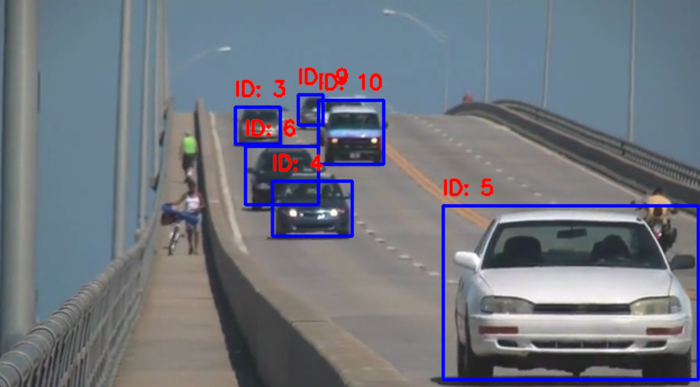
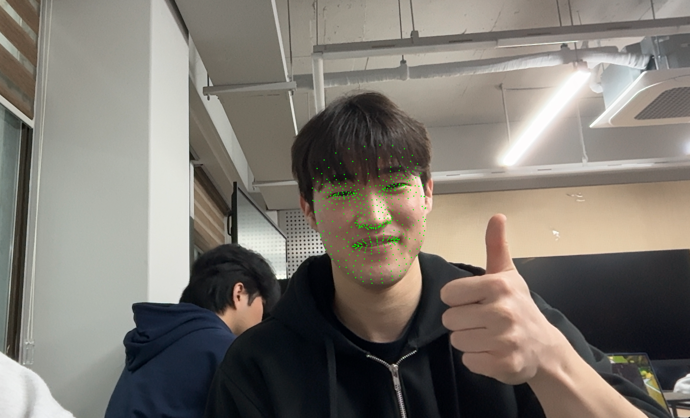

# 📂 Deep Learning 실습
## 01. YOLOv3와 SORT를 이용한 차량 객체 추적
[Vehicle Object Tracking using YOLOv3 and SORT]

### 1. 문제 설명

실시간 교통량 분석이나 자율 주행 시스템의 기초가 되는 객체 추적 기술을 구현합니다. YOLOv3를 사용하여 이미지 내의 차량(자동차, 버스, 트럭 등)을 검출하고, 검출된 객체에 SORT(Simple Online and Realtime Tracking) 알고리즘을 적용하여 프레임이 바뀌어도 동일한 객체에 고유한 ID를 부여하고 추적하는 것이 목표입니다.

### 2. 코드
```python
import cv2 # OpenCV 라이브러리 임포트
import numpy as np # NumPy 라이브러리 임포트
from sort import Sort # SORT 추적기 임포트 (

# 1. 모델 및 추적기 초기화
net = cv2.dnn.readNet("yolov3.weights", "yolov3.cfg")
layer_names = net.getLayerNames() # YOLOv3의 레이어 이름 가져오기
output_layers = [layer_names[i - 1] for i in net.getUnconnectedOutLayers()] # 출력 레이어 인덱스 가져오기
tracker = Sort() # SORT 추적기 초기화

# 2. 비디오 캡처 설정
cap = cv2.VideoCapture("slow_traffic_small.mp4")
vehicle_class_ids = [2, 3, 5, 7] # 자동차, 오토바이, 버스, 트럭

while cap.isOpened(): # 비디오가 열려 있는 동안 반복
    ret, frame = cap.read() # 프레임 읽기
    if not ret: break
    height, width, _ = frame.shape # 프레임의 높이와 너비 가져오기

    # 3. 객체 검출 (YOLOv3)
    blob = cv2.dnn.blobFromImage(frame, 0.00392, (416, 416), (0, 0, 0), True, crop=False) # 이미지 전처리
    net.setInput(blob) # 네트워크에 입력 설정
    outs = net.forward(output_layers) # 네트워크 실행하여 출력 가져오기

    boxes, confidences = [], [] # 검출된 객체의 바운딩 박스와 신뢰도 저장할 리스트 초기화
    for out in outs: # 출력 레이어마다 반복
        for detection in out: 
            scores = detection[5:] # 클래스별 신뢰도 점수 가져오기
            class_id = np.argmax(scores) # 가장 높은 신뢰도 점수의 클래스 ID 가져오기
            confidence = scores[class_id] # 해당 클래스의 신뢰도 점수 가져오기
            if confidence > 0.5 and class_id in vehicle_class_ids: # 신뢰도가 0.5 이상이고 차량 클래스인 경우
                center_x, center_y = int(detection[0] * width), int(detection[1] * height) # 바운딩 박스 중심 좌표 계산
                w, h = int(detection[2] * width), int(detection[3] * height) # 바운딩 박스 너비와 높이 계산
                boxes.append([int(center_x - w / 2), int(center_y - h / 2), w, h]) # 바운딩 박스 좌표 저장
                confidences.append(float(confidence)) # 신뢰도 저장

    indexes = cv2.dnn.NMSBoxes(boxes, confidences, 0.5, 0.4) # 비최대 억제 적용하여 중복된 박스 제거

    # 4. 객체 추적 (SORT)
    dets = []
    if len(indexes) > 0:
        for i in indexes.flatten():
            x, y, w, h = boxes[i] # 바운딩 박스 좌표 가져오기
            dets.append([x, y, x + w, y + h, confidences[i]]) # SORT에 입력할 형식으로 변환하여 저장
    dets = np.array(dets) if len(dets) > 0 else np.empty((0, 5)) # 검출된 객체가 없는 경우 빈 배열 생성
    trackers = tracker.update(dets) # SORT 추적기 업데이트하여 트랙킹된 객체의 바운딩 박스와 ID 가져오기

    # 5. 결과 시각화
    for d in trackers:
        x1, y1, x2, y2, track_id = [int(i) for i in d] # 트랙킹된 객체의 바운딩 박스 좌표와 ID 가져오기
        cv2.rectangle(frame, (x1, y1), (x2, y2), (255, 0, 0), 2) # 바운딩 박스 그리기
        cv2.putText(frame, f"ID: {track_id}", (x1, y1 - 10), cv2.FONT_HERSHEY_SIMPLEX, 0.6, (0, 0, 255), 2) # 트랙킹된 객체의 ID 표시

    cv2.imshow("Traffic Object Tracking", frame) # 결과 프레임 보여주기
    if cv2.waitKey(1) & 0xFF == ord('q'): break

cap.release() # 비디오 캡처 해제
cv2.destroyAllWindows() # 모든 OpenCV 창 닫기
```
### 3. 해결 방법

객체 검출 (YOLOv3): 미리 학습된 YOLOv3 가중치와 설정 파일을 로드하여 cv2.dnn 모듈을 통해 프레임 내 객체를 검출합니다. 차량과 관련된 클래스 ID(2, 3, 5, 7)만 필터링합니다.

중복 제거 (NMS): 비최대 억제(Non-Maximum Suppression) 알고리즘을 적용하여 동일 객체에 대해 생성된 여러 개의 바운딩 박스 중 신뢰도가 가장 높은 박스만 남깁니다.

객체 추적 (SORT): 칼만 필터(Kalman Filter)와 헝가리안 알고리즘(Hungarian Algorithm) 기반의 SORT를 활용합니다. 이전 프레임의 객체 위치를 예측하고 현재 프레임의 검출 결과와 매칭하여 각 차량에 지속적인 Track ID를 부여합니다.

시각화: 추적된 객체의 좌표를 바탕으로 사각형 박스를 그리고, 상단에 고유 ID를 표시하여 추적 상태를 확인합니다.

### 4. 출력 결과



## 02. MediaPipe를 활용한 실시간 얼굴 랜드마크 추출
[Real-time Face Landmark Extraction using MediaPipe]

### 1. 문제 설명

Google에서 제공하는 MediaPipe 솔루션을 사용하여 웹캠 영상에서 실시간으로 얼굴의 특징점(Landmarks)을 추출합니다. 얼굴의 윤곽, 눈, 코, 입 등 수백 개의 고밀도 랜드마크를 3D 좌표로 계산하여 증강 현실(AR) 필터나 표정 분석의 기초 데이터로 활용할 수 있는 구조를 구축합니다.

### 2. 코드
```python
import cv2 # OpenCV 라이브러리 임포트
import mediapipe as mp # MediaPipe 라이브러리 임포트

# 1. FaceMesh 초기화
mp_face_mesh = mp.solutions.face_mesh # FaceMesh 솔루션 가져오기
face_mesh = mp_face_mesh.FaceMesh( # FaceMesh 객체 초기화
    max_num_faces=1,
    refine_landmarks=True,
    min_detection_confidence=0.5,
    min_tracking_confidence=0.5
)

# 2. 웹캠 캡처 설정
cap = cv2.VideoCapture(0)

while cap.isOpened(): # 웹캠이 열려 있는 동안 반복
    ret, frame = cap.read() # 프레임 읽기
    if not ret: break

    height, width, _ = frame.shape # 프레임의 높이와 너비 가져오기
    rgb_frame = cv2.cvtColor(frame, cv2.COLOR_BGR2RGB) # OpenCV는 BGR 형식을 사용하므로 RGB로 변환

    # 3. 랜드마크 추출
    results = face_mesh.process(rgb_frame)

    # 4. 결과 시각화
    if results.multi_face_landmarks: # 얼굴 랜드마크가 검출된 경우
        for face_landmarks in results.multi_face_landmarks: 
            for landmark in face_landmarks.landmark: 
                x = int(landmark.x * width) # 랜드마크의 x 좌표 계산
                y = int(landmark.y * height) # 랜드마크의 y 좌표 계산
                cv2.circle(frame, (x, y), 1, (0, 255, 0), -1) # 랜드마크 위치에 작은 원 그리기

    cv2.imshow('Mediapipe Face Landmark', frame) # 결과 프레임 보여주기
    # 5. ESC(27) 누르면 종료
    if cv2.waitKey(1) & 0xFF == 27: break

cap.release() # 웹캠 캡처 해제
cv2.destroyAllWindows() # 모든 OpenCV 창 닫기
```

### 3. 해결 방법

FaceMesh 초기화: mp.solutions.face_mesh를 사용하여 얼굴 인식 모델을 설정합니다. refine_landmarks=True 옵션을 통해 눈부위나 입술의 정밀도를 높입니다.

색상 공간 변환: OpenCV는 기본적으로 BGR 형식을 사용하지만, MediaPipe는 RGB 입력을 요구하므로 cv2.cvtColor를 통해 변환 과정을 거칩니다.

좌표 계산: 모델이 반환하는 랜드마크 값은 0~1 사이의 정규화된 값이므로, 이를 현재 프레임의 실제 해상도(너비, 높이)와 곱하여 픽셀 좌표계로 변환합니다.

결과 시각화: 계산된 각 좌표 위치에 cv2.circle을 사용하여 작은 점을 그려 얼굴의 형태가 실시간으로 트래킹되는 모습을 시각화합니다.

### 4. 출력 결과
